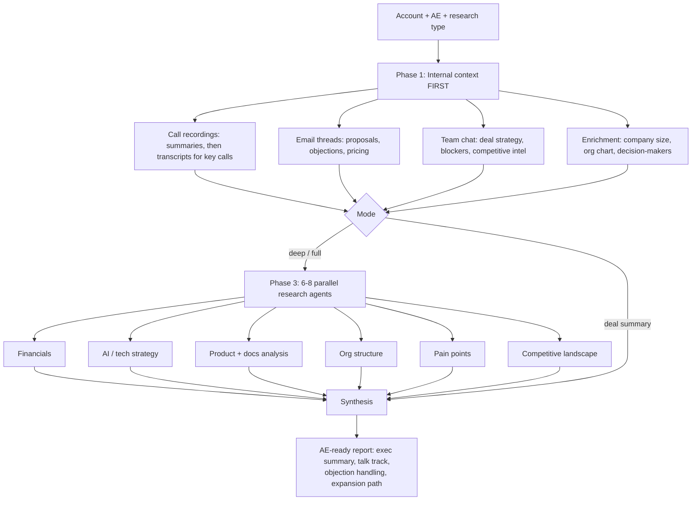

# AI Account-Research Agent

A multi-agent system that prepares an account executive for a deal by fusing internal deal context with external company intelligence, then turning it into a talk track, objection handling, and an expansion plan. Hours of manual pre-call prep compressed into minutes.

> Built as an internal tool at a B2B AI company. Customer names and internal specifics removed for this public writeup.

---

## The problem

Good account research is expensive in exactly the wrong way. The intelligence an AE needs before a call is split across two worlds that never talk to each other:

- **Internal:** what the prospect actually said on past calls, what was promised over email, what the team flagged in chat, what the CRM and enrichment tools know. This is the deal-specific context no web search can reach.
- **External:** the company's financials, AI strategy, org chart, product and documentation gaps, developer pain points, and competitive position.

Pulling both together by hand takes an AE one to three hours per account, so it usually does not happen. Reps walk into calls with a logo and a guess. And even when the research gets done, it is a pile of facts with no "so what," which is the part that actually moves a deal.

## What I built

An agent that runs internal-context-first, then fans out external research in parallel, and synthesizes everything into an AE-ready report. It supports four modes:

| Mode | Produces |
|------|----------|
| **Deal summary** | Synthesis of every recorded call + email + chat into deal status, blockers, buying/risk signals, next steps |
| **Deep research** | Full strategic intelligence: financials, AI strategy, org structure, product/docs analysis, pain points, competitive landscape |
| **Specific question** | A targeted research report answering one question about the account (e.g., "are they investing in AI for support?") |
| **Full package** | All of the above, combined |

## How it works

**Phase 1 is internal-first by design.** The AE's own call recordings, emails, and team chat contain deal-specific intelligence no external source has: the exact pain the prospect stated, the objection raised on email, the competitor the team spotted. The agent mines these before touching the web, pulling call *summaries* first and only fetching full transcripts for the high-value calls (demos, pricing, exec conversations) to stay efficient.

**Phase 3 fans out.** Six to eight research agents run *simultaneously* in the background, one per dimension, rather than sequentially. This is roughly 5-8x faster and is what makes full research practical to run before a call instead of after the deal is lost.

## The hard problems I solved

1. **Internal-before-external, enforced.** Most "research a company" tools jump straight to the web and miss the deal. Sequencing internal context first means the external research is *aimed* (the agent knows from the calls that the real question is "do they use Freshdesk and are they moving to AI support?") instead of generic.

2. **Every finding carries a "so what."** A fact without a sales implication is noise. The synthesis connects each finding to an action: what to say, which objection it answers, how it advances the deal. "EUR 82.9B revenue across six divisions with 1,200+ recorded outages" becomes a talk track, not trivia.

3. **Mirror the account's own language.** If their CEO says "digital by default" or names an initiative "Strategy 2030," the talk track uses those exact phrases. Research that speaks the prospect's language lands; research that speaks vendor-marketing language does not.

4. **Honest risk, not just buying signals.** The report surfaces deal blockers, competitive threats, and internal escalations alongside the positive signals, because an AE walking in half-informed loses. Each blocker comes with a mitigation.

5. **Parallelism as a design constraint, not an afterthought.** The deep-research phase is built around concurrent background agents with tight per-agent output contracts, so breadth does not cost wall-clock time.

## Tech and tools

- **Orchestration:** Multi-agent fan-out (6-8 concurrent background research agents) with a synthesis pass.
- **Internal sources:** Call-recording platform (search + summaries + transcripts), email, team chat, sales-intelligence enrichment, all via MCP tools.
- **External research:** Web search and fetch across annual reports, earnings calls, exec interviews, developer docs, and community forums (Stack Overflow, Reddit, GitHub, review sites).
- **Output:** Structured Markdown deal reports and deep-research dossiers with exec summary, evidence tables, talk tracks, objection handling, and a phased expansion path with pricing.

## Impact

- Pre-call research time cut from **1-3 hours** to **5-10 minutes** per account.
- Adopted across **every active deal the AE team was working**, with talk tracks and objection handling grounded in the prospect's own words.

## What this demonstrates

- **Multi-agent orchestration** applied to a real revenue workflow, not a demo.
- The instinct to **fuse internal and external data** and to sequence them correctly.
- **GTM craft**: turning research into talk tracks, objection handling, and expansion paths that an AE can actually use on the next call.
