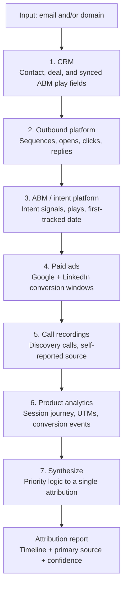

# Multi-Channel Demo Attribution Engine

An AI agent that traces how a B2B demo booking was actually sourced by cross-referencing seven go-to-market channels, and resolves the contradictions between them into a single, defensible attribution call.

> Built as a working internal tool at a B2B AI company. Customer names, account IDs, and credentials have been removed for this public writeup.

**Source:** [agent.md](./agent.md) — the sanitized agent definition.

---

## The problem

Attribution in B2B is broken in a specific, expensive way: **the CRM lies, and it lies in a predictable direction.**

A prospect books a demo. HubSpot stamps the source as "Direct." Leadership reads that as "organic, we didn't pay for it," and the outbound and paid teams get no credit. But the truth is usually messier:

- An outbound sequence touched a *different person* at the same company three weeks earlier.
- A paid ad ran in the conversion window but can only report aggregate counts, never who converted.
- The prospect literally said "your team emailed me" on the discovery call, but that signal lives in a call transcript no dashboard reads.

No single tool sees the whole picture. The data needed to attribute one booking is scattered across the CRM, the outbound platform, the ABM/intent platform, two ad platforms, the call-recording tool, and the product analytics warehouse, each exposing a different slice through a different API. Doing this by hand takes an analyst 30 to 60 minutes per deal and still misses cross-contact outbound touches.

## What I built

A single agent that takes a **company domain and/or email** and runs a deterministic seven-step investigation across every channel, then synthesizes the evidence into a multi-touch timeline and a primary-source call with a confidence rating.

It is built to be resilient: if any channel's API is down or returns an error, it logs the gap and continues, because a partial attribution is still useful and the investigation should never halt on one failure.

## Architecture

| Step | Channel | What it pulls | Why it matters |
|------|---------|---------------|----------------|
| 1 | CRM | Contact, deal, `hs_analytics_source`, plus **ABM play fields synced into the CRM** | Reference timestamp + the most valuable outbound signal, which the ABM tool's own API does not expose |
| 2 | Outbound platform | Sequence membership, mailing engagement (opens/clicks/replies) | Did outbound touch them before booking, and did they engage? |
| 3 | ABM / intent | Person + company records, intent signals, first-tracked date | Was buying intent detected before the deal existed? |
| 4 | Paid ads (Google, LinkedIn) | Campaign conversions in a 7-day window around booking | Correlation only (aggregate, never individual), used as a tiebreaker |
| 5 | Call recordings | Discovery-call participants, topics, and direct quotes | Prospects often *say* how they found us. Strongest signal there is. |
| 6 | Product analytics | Session journey, UTM params, native conversion events via HogQL | Exact digital path and campaign when UTMs are present |
| 7 | Synthesis | All of the above | One call, with reasoning |

## The hard problems I solved

This is where the real GTM judgment lives. The plumbing is the easy part.

1. **The CRM "Direct" trap.** HubSpot frequently reports "Direct" for deals that were actually outbound-sourced. The engine treats `hs_analytics_source` as a *low-priority fallback*, not truth, and overrides it whenever a preceding outbound play or sequence is found. This single rule re-attributes a meaningful share of "organic" deals to the teams that actually earned them.

2. **Attribution across contacts, not just the booker.** Outbound often targets one persona (say, a CS leader) while a different colleague books the demo. The engine searches *all* contacts at the domain and traces touches across people, not just the email that converted. Per-person attribution would have missed these entirely.

3. **Finding the signal where it actually lives.** The ABM platform's Data API exposes only CRM-style records, not play or engagement activity. The highest-value outbound signal is actually the ABM fields *synced into the CRM*. Knowing that, rather than trusting each tool's primary API, is the difference between right and wrong answers.

4. **A priority hierarchy that ranks evidence quality.** Not all signals are equal. A prospect saying "I saw your LinkedIn ad" on a call outranks any UTM parameter, which outranks an aggregate paid-ad timing match. I encoded a nine-tier priority so the agent reasons about *evidence strength*, not just presence.

5. **Production resilience.** Known failure modes are handled explicitly: skip-and-log on API errors, the correct native conversion event names (not the ad-platform conversion tags that look similar), and finite, correctly formatted date windows for each platform's query language.

## Attribution priority logic (condensed)

| Priority | Signal | Attribution |
|----------|--------|-------------|
| 1 | Prospect states the source on a recorded call | Direct verbal (highest confidence) |
| 2 | UTM / click ID on the conversion event | Direct digital |
| 3 | ABM play on any contact at the company before the deal | Outbound sourced (ABM) |
| 4 | Outbound reply before booking | Outbound sourced |
| 5 | Outbound open/click, no reply | Outbound assisted |
| 6 | Intent signal before booking | Intent-driven |
| 7 | CRM source field | CRM-reported (fallback) |
| 8 | Paid conversion in the time window | Paid (correlated, not proven) |
| 9 | No match | Unknown / organic |

## Tech and tools

- **Orchestration:** A multi-step Claude agent (deterministic step order, graceful degradation, ~30-turn budget).
- **Query languages:** HogQL (product analytics), GAQL (Google Ads), CRM and outbound platform search APIs.
- **Integrations:** CRM, outbound platform, ABM/intent platform, Google Ads, LinkedIn Ads, call-recording platform, product analytics, all via MCP tools.
- **Output:** A structured Markdown report with a channel-by-channel evidence section, a chronological engagement timeline, and a reasoned primary-source call.

## Impact

- Attribution time reduced from **30-60 minutes** of manual analyst work per deal to **5-10 minutes**, running from a single reusable prompt rather than a fresh per-deal investigation.
- **~40%** of deals the CRM labeled "Direct" were re-attributed to outbound or paid once cross-channel evidence was applied, materially changing how the team credited channels and where it put budget.
- Ran across **a full year of demo bookings**, giving the team trustworthy source-of-pipeline data for board reporting and channel-budget decisions.

## What this demonstrates

- **Revenue infrastructure built with AI**, not a deck about it.
- Fluency across the **full modern GTM stack** (CRM, outbound, ABM, paid, calls, product analytics) and the APIs/query languages behind each.
- The **GTM judgment** to know which signals to trust and why, which is the part you cannot automate without understanding the work.
- An **engineering mindset**: deterministic flow, failure handling, and correctness about the small things that quietly break attribution.
