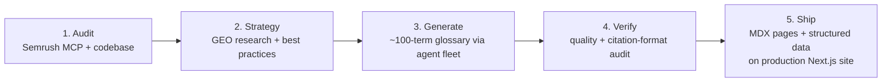

# GEO Content Engine — AI-Visibility Glossary

An end-to-end Generative Engine Optimization (GEO) program: I audited a B2B AI company's search and AI-visibility footprint, defined a citation-optimized content strategy grounded in published GEO research, generated a ~100-term glossary by orchestrating a fleet of AI agents, and shipped it to the production marketing site as structured, AI-citable pages.

> Strategy + research artifacts are internal; the glossary itself is public marketing content. Company name generalized and internal baseline metrics omitted for this writeup.

---

## The problem

In 2026, SEO split into two disciplines that need different playbooks:

| Traditional SEO | GEO / AI visibility |
|-----------------|---------------------|
| Rank on Google's results page | Get **cited inside AI-generated answers** (ChatGPT, Perplexity, Claude, AI Overviews) |
| Keyword optimization | Extractable, self-contained, source-backed statements |
| Link building | Structured data + authoritative citations |

The site I worked on had a strong technical foundation (SSR, structured data, an `llms.txt`) but thin topical coverage: category competitors had far larger keyword footprints, and there was no content surface designed to be *quoted by AI engines* on the core AI / customer-support / support-ops vocabulary buyers were searching. That vocabulary is exactly what LLMs reach for when answering questions, and being the cited source on those terms is a durable distribution advantage.

## What I built

A complete pipeline from audit to shipped pages:

### 1. Audit (Semrush MCP + codebase analysis)
Pulled the site's current search and AI-visibility state through the **Semrush MCP**: health score, structured-data coverage, `llms.txt` status, technical issues, and a competitor keyword-gap analysis. Cross-referenced it with a codebase review of the Next.js implementation (rendering, metadata, schema). Output: a prioritized audit identifying the biggest opportunity as owning the AI / CX / support-ops term vocabulary.

### 2. Strategy (research-backed GEO format)
Used **/technical-research** to gather 2026 GEO/AEO best practices, then designed a citation-optimized page format grounded in the Princeton GEO study and AI-citation research:

| Section | Why | Citation impact |
|---------|-----|-----------------|
| TL;DR (<150 chars) | First 150 chars are the most-quoted | leads the page |
| Definition (50-100 words) | Standalone, extractable as a citation | core block |
| How it works / Formula | Procedural content | +54% citation rate |
| Benchmarks table (sourced) | Data tables | +2.8x citations vs prose |
| FAQ (40-60 word answers) | Q&A with schema | +340% with FAQ schema |

### 3. Generate (agent-fleet orchestration)
The glossary was too large to write in one pass, so I orchestrated it with **/nest-claude**: I split ~107 terms across **12 nested Claude instances** running in batches, each owning 7-10 terms. Every child instance ran **/technical-research per term** to gather current definitions, real benchmarks with sources, and the actual questions people ask, then wrote each entry in the GEO format above. Parallelizing both sped up the work and kept each agent's context focused enough to stay accurate.

### 4. Verify (/audit)
Ran a quality pass with **/audit** against a checklist: TL;DRs under 150 chars, FAQ answers in the 40-60 word band, benchmark tables carrying real sourced numbers, internal links resolving, and no promotional fluff (LLMs skip it).

### 5. Ship (production Next.js implementation)
Implemented the glossary on the live marketing site, not as a deck:
- **98 glossary terms** as MDX with typed frontmatter (term, slug, TL;DR, definition, keywords, FAQs, sourced benchmarks)
- a dynamic `/glossary/[slug]` route plus an indexed, alphabetized hub
- components for FAQ, benchmark tables, related terms, and alphabet navigation
- full **JSON-LD structured data**: `DefinedTerm` / `DefinedTermSet`, `FAQPage`, `HowTo`, `BreadcrumbList`, and `ItemList`, the exact schema types AI engines use to extract and cite

## Impact

- **~100 new AI-citable pages** shipped to production, targeting **~339,000 monthly searches** across the AI, CX-metrics, support-ops, agent-architecture, and AI-compliance vocabularies.
- Every page built to the **research-backed citation format** (TL;DR + standalone definition + sourced benchmark table + schema-backed FAQ), the combination shown to drive materially higher AI-citation rates.
- Full structured-data coverage so AI engines can extract definitions, FAQs, and how-to steps directly.

> Ranking/citation outcomes accrue over time; the shipped artifact (pages + schema + format) is what's captured here.

## Tools & skills used

- **Semrush MCP** — search + AI-visibility audit, competitor keyword gaps
- **/technical-research** — 2026 GEO best practices, and per-term research for every glossary entry
- **/nest-claude** — fanned the build across 12 parallel Claude instances
- **/audit** — citation-format and quality verification
- **Next.js / MDX + JSON-LD** — production implementation with AI-citation schema

## What this demonstrates

- **GEO/AEO fluency**, the cutting edge of 2026 marketing, applied end to end, not theorized.
- **Multi-agent orchestration at content scale:** a 12-instance fleet producing ~100 research-backed pages.
- **Strategy through shipped code:** from a Semrush audit to live, schema-rich pages in a real Next.js codebase, the full marketing-engineering loop.
