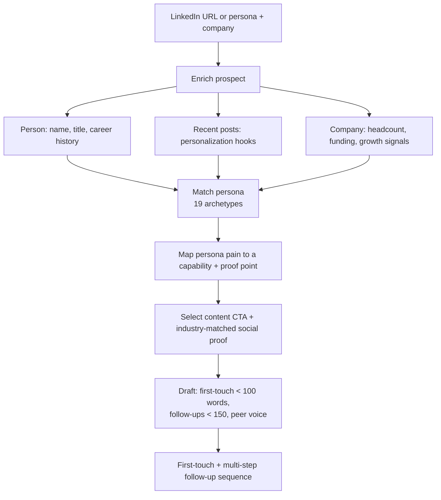

# AI Personalized Outbound at Scale

A persona-aware cold-email system that enriches a prospect from a single LinkedIn URL and generates first-touch and follow-up messaging tailored to who they are and what they care about, so personalization survives scale instead of collapsing into mail-merge.

> Built as an internal tool at a B2B AI company. Product proof points and customer names removed for this public writeup.

---

## The problem

Outbound has a scale-versus-quality tradeoff that most teams resolve in the wrong direction. Generic templated blasts scale but get ignored (reply rates have fallen to ~3% industry-wide). Genuinely personalized emails convert but take 15-20 minutes of research each, so they do not scale. And the 2026 twist: AI-generated outreach makes the problem *worse* when it is used to mass-produce bland text, because buyers can tell, and it burns deliverability and credibility.

The real job is to make personalization cheap *without* making it generic, and to keep a human voice while using AI to do the research.

## What I built

A system that takes a prospect's LinkedIn URL, enriches a rich profile, matches the right persona playbook, and generates outreach that reads like a peer wrote it, not a content team.

**Persona library (19 archetypes).** Founder/CEO, CTO, VP Engineering, CIO, CPO, Product Directors, VP CX, Head of Support, Support Ops, DevRel, Head of Docs, Technical Writer, Head of Community, VP Growth, Head of AI, and more. Each carries its own pain points, buying behavior, and anti-patterns, so a message to a Head of Support is built differently from one to a CTO.

**Enrichment-driven personalization.** From one LinkedIn URL, the system pulls the prospect's role and company, their career trajectory, and their recent posts, then ranks hooks: a relevant recent post beats a role-based hook, which beats a career-trajectory angle, which beats a generic company-growth signal. The strongest available hook leads the email.

**Pain-to-capability matching.** Rather than leading with features, it identifies the persona's actual pain, maps it to the right product capability, and attaches a proof point matched to their industry and size, then states the *outcome* first and connects to capability second.

## The hard problems I solved

1. **A hard guardrail against the wrong voice.** The system explicitly forbids the company's long-form marketing/blog voice in emails. Blog voice is explanatory, positioning-heavy, and paragraph-long; cold email has to be peer-to-peer, plain (a fifth-grader could read it), one idea per line, and outcome-focused. Encoding this as a rule is what keeps AI-assisted output from sounding AI-generated.

2. **Personalization that ranks hooks, not just inserts variables.** Mail-merge swaps in `{first_name}`. This ranks *which* real signal is the most compelling reason to reach out for this specific person, and opens with that. The difference between "Hi {name}, I saw {company} is growing" and "Your post last week on deflecting support tickets with docs..." is the whole game.

3. **Persona-specific, not one-size-fits-all.** Nineteen archetypes each with distinct pain and anti-patterns means the message respects how that buyer actually evaluates. A Support Ops leader and a VP Growth do not respond to the same frame.

4. **Outcome-first, feature-last.** A discipline enforced throughout: never open with the product. Open with the prospect's problem or a credible outcome, then connect to the capability only as much as needed.

5. **Sequenced, not single-shot.** First-touch stays under ~100 words; follow-ups stay under ~150 and layer in a content CTA and social proof matched to the buying stage (awareness, consideration, decision), so the sequence builds rather than repeats.

## Tech and tools

- **Enrichment:** LinkedIn person + company enrichment and recent-post retrieval via MCP tools.
- **Knowledge base:** A persona library, product-capability/proof-point mapping, an industry-matched customer-proof set, and a content-CTA mapping, all as structured references the generator reads at runtime.
- **Generation:** LLM drafting constrained by an explicit voice guardrail, length limits, and an outcome-first structure.
- **Output:** First-touch email plus a multi-step follow-up sequence, with optional A/B variants.

## Impact

- Personalized first-touch produced in **1-2 minutes** vs **15-20 minutes** of manual research per prospect.
- Reply rate roughly **tripled, from ~3% to ~9%**, versus prior templated outbound.
- Covered **19 buyer personas** across the full technical-and-business buying committee.

## What this demonstrates

- **AI used to remove the scale-quality tradeoff in outbound**, the core GTM-engineering problem, with a voice guardrail that keeps it human.
- Deep **buyer-persona fluency** across a full technical and economic buying committee.
- The judgment to **rank signals and lead with the strongest**, which is what separates real personalization from variable insertion.
