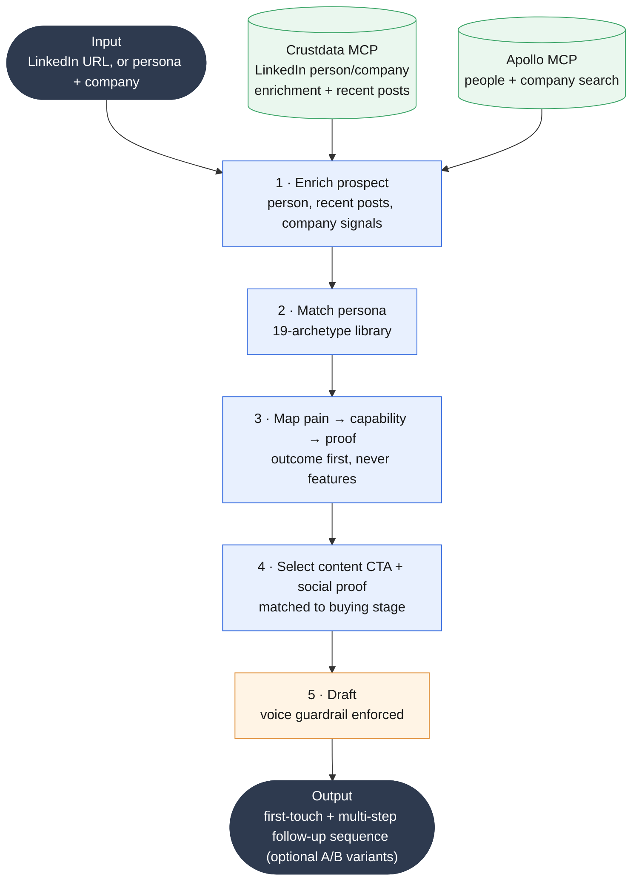

<!--
Sanitized architecture of a skill I built (persona-aware cold-email generation).
This is a DESIGN SPEC, not the raw skill: the proprietary product positioning,
customer proof points, competitive messaging, and worked examples have been
deliberately removed because they are my employer's confidential GTM material.
What remains is the engineering I authored: the workflow, the persona model,
the enrichment integration, the signal-ranking, and the voice guardrail.
-->

# Personalized Outbound — Skill Architecture

A persona-aware cold-email generation skill. Given a prospect (ideally a LinkedIn URL), it enriches a rich profile, matches the right persona playbook, maps the persona's pain to a relevant capability and proof point, and drafts first-touch + follow-up emails in a deliberately human voice.

> Design spec only. Product-specific proof points, customer references, and worked examples are omitted on purpose (employer-confidential).

## Pipeline

Step 1 runs entirely on MCP tool calls: from a single LinkedIn URL, the skill calls the **Crustdata MCP** for person/company enrichment and recent posts, and the **Apollo MCP** for people/company search, then merges them into one enriched profile. (See the [MCP stack](../mcp-stack/README.md) for those servers.)

Step detail:

1. **Enrich prospect** (via Crustdata + Apollo MCP) — person (name, title, company, career history), recent posts (top personalization hook), company (headcount, funding, growth signals).
2. **Match persona** — identify the buyer archetype from title/role, then load that persona's pain points, buying behavior, and anti-patterns.
3. **Map pain → capability → proof** — select the capability that addresses the persona's actual pain, attach an industry/size-matched proof point, and state outcome first, capability second (never lead with features).
4. **Select content CTA + social proof** — match a resource to the buying stage (awareness / consideration / decision) and add 1-2 industry-matched proof references (follow-ups only).
5. **Draft** — first-touch under 100 words, follow-ups under 150; peer-to-peer voice, one idea per line, plain language (voice guardrail enforced).

## The persona model (19 archetypes)

The full technical-and-economic buying committee, each with its own pain points, buying behavior, and anti-patterns:

> Founder/CEO · CTO · VP Engineering · CIO · CPO · Product Directors · VP CX · Head of Support · Support Ops / CX Ops · DevRel · Head of Docs · Technical Writer · Head of Community · VP/Head of Growth · Head of AI · and more.

A message to a Head of Support is constructed differently from one to a CTO: different pain, different proof, different CTA. The persona library is what makes the output role-aware instead of generic.

## Enrichment-driven personalization (the signal-ranking)

From a single LinkedIn URL, the skill pulls person, recent-post, and company data through the **Crustdata** and **Apollo** MCP servers, then ranks hooks by strength rather than blindly inserting variables:

1. **Recent relevant post** — strongest hook when present
2. **Current role + company context** — product-specific angle
3. **Career trajectory** — e.g., "since moving from [prior role]..."
4. **Company growth signal** — funding, headcount growth

The single strongest available signal leads the email. This is the difference between real personalization and mail-merge.

## The voice guardrail (the hard part)

The skill explicitly forbids long-form marketing/blog voice in emails and enforces a different register:

| Marketing/blog voice (forbidden) | Cold-email voice (enforced) |
|----------------------------------|------------------------------|
| Explanatory, educational | Direct, peer-to-peer |
| Long paragraphs with context | Short sentences, one idea per line |
| Marketing language and positioning | Plain, credible language |
| Feature descriptions | Outcome-focused statements |
| Thought-leadership framing | Problem acknowledgment |

Encoding this as a hard rule is what keeps AI-assisted drafting from reading as AI-generated, the failure mode that kills deliverability and credibility in 2026.

## Sequence logic

- **Email 1:** anchor on the persona's pain + one proof point, interest-based CTA (shortest).
- **Emails 2-3:** layer in a content CTA and social proof matched to the buying stage, each under ~150 words, so the sequence builds rather than repeats.

## Reference modules (internal, not included here)

The runtime reads structured reference files at generation time: a persona library, a capability/proof mapping, an industry-matched proof set, and a content-CTA mapping. These contain employer-confidential positioning and are intentionally excluded from this public copy.

## What this demonstrates

- A real system that removes the **scale-versus-quality tradeoff** in outbound.
- Deep **buyer-persona fluency** across a full technical and economic committee.
- The engineering judgment to **rank signals and enforce a voice guardrail**, rather than just templating an LLM call.
