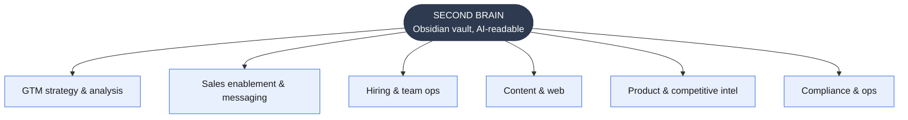
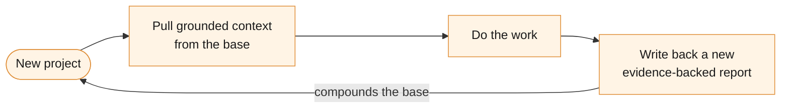

# Second Brain — AI-Ready Company Knowledge Base

The context layer under everything else in this portfolio. I built a structured, evidence-backed research corpus, a "second brain", so that AI agents (and people) can get grounded company context in seconds, and so every new project starts from accumulated knowledge instead of a blank page.

> **Confidential.** This describes the *system and methodology* only. The corpus itself contains product intelligence, competitive teardowns, prospect analysis, customer data, and GTM strategy, none of it is reproduced here. No contents are included in this repo.

---

## The problem

AI-native GTM work runs on context. An attribution agent, an account-research agent, a messaging playbook, a GEO program, each is only as good as what it knows about the company, its product, its buyers, and its market. In most orgs that knowledge is scattered across decks, threads, and people's heads: hard for a new hire to absorb, impossible for an AI agent to retrieve, and stale the moment it's written.

Two costs follow: every new project re-gathers the same context from scratch, and AI agents operate on thin or outdated information.

## What I built

A single, structured knowledge base, maintained as an **Obsidian vault**, that treats company knowledge as a compounding asset built for AI retrieval:

- **~340 documents, ~6.8MB**, organized into **6 GTM/marketing domains**
- **32 multi-document research projects**, each with a synthesized report plus its own **primary-source `evidence/` files** (24 evidence sets in total)
- **55 documents carry structured frontmatter** (title, description, dates, `subjects`, `topics`), the metadata that makes the corpus semantically discoverable by AI rather than just a pile of files

### The domains it covers

| Domain | What lives here |
|--------|-----------------|
| GTM strategy & analysis | playbooks, market/AI-progression analysis, funnel analysis |
| Sales enablement & messaging | battle cards, persona messaging, pain-point messaging, targeting filters |
| Hiring & team ops | hiring decision frameworks, onboarding playbooks, team blueprints |
| Content & web | blog, brand/tone, email, landing pages, paid, SEO/GEO |
| Product & competitive intelligence | product intelligence, competitive landscapes, prospect analysis |
| Compliance & ops | third-party ToS / privacy frameworks |

## Retrieval: from frontmatter-discoverable to semantically searchable

Everything below describes how the corpus is *organized*. Separately (as a personal, self-directed project, not part of the company-scoped work in the rest of this portfolio — see [Semantic Search (RAG) MCP Server](../semantic-search-mcp/)), I built a local RAG layer on top of this same vault: every document chunked and embedded locally, served through a custom MCP server, so an agent can retrieve conceptually relevant material by meaning, not just by matching frontmatter or exact keywords. Structured frontmatter and semantic search are complementary, not competing: frontmatter is precise for "what domain is this," embeddings are precise for "what's conceptually related to this, even if worded differently."

The vault has also grown since this system was first documented, from ~340 tracked documents to ~556 files (~1.04M words) at last count, growth the semantic layer has to keep pace with, which is exactly why `reindex` is exposed as a callable tool rather than a one-time script.

The two retrieval mechanisms don't just coexist, the semantic layer actively **audits** the wiki-link graph described below: a `suggest_links` tool built on the same embeddings surfaces document pairs that are conceptually related but not yet cross-linked, a standing, low-effort check on whether the hand-authored graph has gaps. Full mechanics in the [Semantic Search README](../semantic-search-mcp/#how-this-coexists-with-second-brains-knowledge-graph).

## How it works

Every project, in any domain, follows the same evidence-backed pattern:

| Part | Contents | Purpose |
|------|----------|---------|
| `frontmatter` | title · description · subjects · topics | AI discovery |
| `REPORT.md` | synthesis: findings, implications, decisions | the answer |
| `evidence/` | primary-source files behind every claim | verifiable |

**The compounding loop**

### The methodology (why each doc strengthens the others)

Every project is built the same disciplined way, which is what turns a folder of notes into a reliable knowledge base:

1. **Rubric first** — scope the questions before researching, so coverage is deliberate.
2. **Primary-source evidence** — claims are backed by `evidence/` files (source snippets, data, citations), so findings are verifiable, not vibes.
3. **Synthesis, not dumps** — `REPORT.md` adds implications and decisions on top of the evidence.
4. **Discoverable by design** — structured frontmatter (`description`, `subjects`, `topics`) lets an agent scan and find the relevant prior work before starting something new, the same "check what we already know" step that prevents redundant research.

Because every document shares this structure, they reinforce each other: a messaging project can pull from product intelligence, a hiring plan can reference GTM strategy, and an AI agent can traverse the whole corpus with consistent expectations.

## Why this is the foundation of the rest of the portfolio

The other pieces were not built in a vacuum, they were built *with this system*:

- The **GEO content engine** used the same evidence-backed research methodology (rubric → sourced evidence → synthesis) at content scale.
- The **account-research agent** is essentially this methodology automated for a single account.
- Every messaging, persona, and strategy input the agents rely on traces back to documents in this base.

In short: this is the **operating system for AI-native GTM work**, the context layer that the MCP stack (the tool layer) and the five systems run on top of.

## What this demonstrates

- **Context engineering for AI:** structuring company knowledge so agents can actually retrieve and reason over it, the prerequisite for any serious AI-native GTM motion.
- **Research discipline at scale:** ~340 evidence-backed documents maintained with one consistent, verifiable methodology.
- **Systems thinking about knowledge:** treating company context as a compounding asset, where each project both consumes and extends the base, rather than a pile of one-off deliverables.
