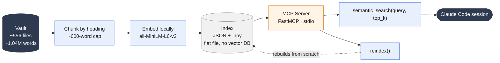
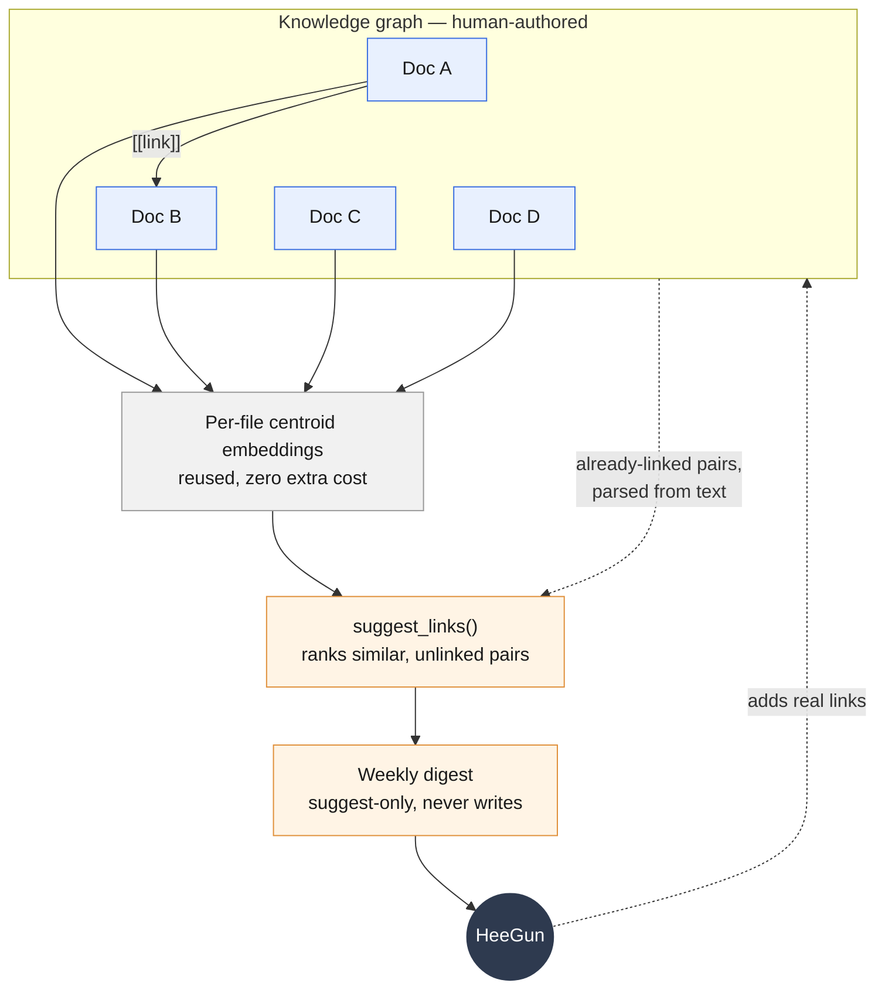

# Semantic Search (RAG) MCP Server — Personal Project

**A personal, self-directed project, built on my own time as part of a technical curriculum covering RAG and MCP server-building, not built inside an employer's revenue org.** Everything else in this portfolio was built and run inside a B2B AI company's GTM stack; this one is over my own personal knowledge vault, and I'm calling that out explicitly rather than blending it in.

> Sanitized for public sharing: this describes the *system and architecture* only. The vault it indexes contains personal and career-related notes, none of that content is reproduced here.

---

## The problem

I keep a personal knowledge vault (hundreds of markdown reports, ~1M+ words) that grows continuously, and it was already wired into Claude Code through an existing MCP server that does keyword/filename/tag search. In practice, that wasn't enough: keyword search only finds content sharing exact terms with a query, not content that's conceptually related but differently worded. I kept manually locating and pasting the right report into context, and reminding Claude of prior work it should have been able to find on its own.

## What I built

A local semantic search layer over the vault, exposed as a custom MCP server, so Claude can retrieve conceptually relevant chunks by meaning rather than exact keyword:

1. **Indexer** — walks the vault, chunks every markdown file by heading section (~600-word cap per chunk, fixed-size fallback for files with no headings), and embeds each chunk locally.
2. **Embeddings** — `all-MiniLM-L6-v2` via local `sentence-transformers`. No API calls, no cost, and no report content or query text ever leaves the machine, a hard requirement given the personal/career data the vault holds.
3. **Index storage** — a flat local file: JSON metadata + a `.npy` vector array. Deliberately not a vector database; at the corpus's current scale (~1,800 chunks) brute-force cosine similarity stays sub-100ms, so a dedicated vector DB would add a dependency and a format to learn without adding capability.
4. **MCP server** — built on FastMCP, stdio transport, exposing two tools: `semantic_search(query, top_k)`, returning ranked chunks with source file, heading, snippet, and score; and `reindex()`, a full rebuild callable mid-session by Claude or from the CLI.
5. **Coexistence, not replacement** — the existing keyword/filename/tag-search MCP server stays exactly as it was. Semantic search is additive: exact-term lookups (a company name, a specific title) are still keyword search's job; conceptual/fuzzy retrieval is the new tool's job.

**Stack:** Python (`uv`) · `sentence-transformers` (`all-MiniLM-L6-v2`) · NumPy · FastMCP · flat-file index (JSON + `.npy`)
**Scale:** ~556 files · ~1.04M words · ~1,800 chunks · sub-second query latency · full reindex in ~2 minutes

*Everything left of the MCP server runs locally and offline; nothing but the query and returned snippets ever reaches a Claude session.*

## Built like real infrastructure, not a script

The part of this I'm most proud of isn't the retrieval, it's the process. Before writing code, I wrote a full spec: problem statement, goals *and explicit non-goals*, and a **locked decision log** covering ten decisions with rationale and confidence level, for example:

- Embeddings: local MiniLM, not a paid API — cost and privacy constraints, both explicit and non-negotiable.
- Storage: flat file, not a vector database — evidence-backed by napkin math on the actual corpus size, not a default reach for infrastructure the problem doesn't need yet.
- No RAG framework (LangChain/LlamaIndex) — hand-rolled on purpose, since the point of the project was to actually understand chunking, embedding, and similarity search, not integrate someone else's abstraction over them.
- Re-indexing: on-demand full rebuild, not live file-watching or incremental updates — an earlier promotion to incremental indexing was **reverted** after a design-challenge audit found the reasoning behind it was speculative rather than evidence-based; the spec's own non-goals require real observed annoyance before adding that complexity, not anticipation of it.

I also wrote an actual test suite (`test_chunking.py`, `test_indexer.py`, `test_search.py`, `test_linking.py`), the only piece in this portfolio with one.

## A second capability, same index, zero extra cost

Once chunks are embedded, I built a `suggest_links` tool on top of the same index: it mean-pools each file's chunk embeddings into a single per-file "centroid" vector, then compares files to each other to surface semantically-similar reports that aren't currently cross-linked, no new embedding cost, since it reuses vectors the indexer already computed. It's suggest-only by design (it never writes a link itself); a human decides whether the suggestion is real.

## How this coexists with Second Brain's knowledge graph

Second Brain's actual navigational structure is an Obsidian **wiki-link graph**: explicit `[[links]]` between documents, hand-authored whenever I write a report that references prior work. That graph is precise but incomplete, it only contains a connection if I happened to notice it and typed the link. The RAG layer doesn't replace that graph or write to it, it **audits** it:

*The loop closes through a person on purpose: `suggest_links` only ever proposes an edge, it never writes one. Doc A and Doc B already have an explicit `[[link]]`; Doc C and Doc D don't, if they score high enough on similarity, they surface in the digest as a candidate, not a confirmed connection, until reviewed.*

- **`suggest_links`** reuses the exact same chunk embeddings the indexer already computed, no new embedding cost, by mean-pooling each file's chunks into one per-file "centroid" vector, then ranking file *pairs* by cosine similarity between centroids (cheap: file-count-squared comparisons instead of chunk-count-squared).
- It cross-references those high-similarity pairs against the graph as it exists today, parsed directly from the already-loaded chunk text (handling `[[Target]]`, `[[Target|Display]]`, and `[[Target#Heading]]` forms), and surfaces only the pairs that are **semantically close but not yet linked**, candidate edges the graph is missing.
- **Fail-open by design:** if a `[[link]]`'s target is ambiguous (matches zero or multiple files), it's treated as "not linked" rather than guessed at, a redundant suggestion is a cheap mistake; a real gap silently marked "already covered" is not.
- **Suggest-only, never writes:** the tool (and the automation built on it) never inserts a link itself. It produces a ranked list; a human decides whether the connection is real.
- **Noise, found empirically and excluded precisely:** the first real run put near-duplicate tailored resumes at the top of the list (95 files sharing one template, scoring 0.97-1.0 against each other, crowding out 14 of the top 15 results). Rather than a broad heuristic, I added a precise filename-pattern exclusion once the actual failure mode was visible, engineering informed by real output, not speculation.
- **Automated on a schedule:** a weekly job reindexes the vault, calls `suggest_links`, filters known noise clusters, dedupes against pairs already surfaced in a prior week, and writes a plain digest file, so the graph gets a standing, low-effort audit instead of relying on me remembering to check.

In a live session, the two systems serve different moments: `semantic_search` finds the right *entry point* by meaning when I don't know what to search for by name; the wiki-link graph then lets whoever's reading (me, or Claude) *navigate outward* from that document via its existing explicit connections. The RAG layer's job is finding the door; the graph's job is the rooms connected to it.

## What this demonstrates

- **Applied ML engineering, not just prompting:** chunking-strategy design, embedding-model selection under real constraints (cost, privacy, latency), and vector similarity search, implemented and understood end to end, not called through someone else's framework.
- **MCP protocol fluency beyond business-tool wrapping:** a second, independently-built MCP server (see also [GTM MCP Stack](../mcp-stack/)), this time for a retrieval system rather than a CRM/outbound API.
- **Spec-first engineering discipline:** goals and non-goals defined before code, a decision log with rationale instead of undocumented choices, and a real willingness to revert a decision (the incremental-reindex reversal) when its own justification didn't hold up.
- **Test coverage:** the only system in this portfolio with an accompanying test suite.
- **Judgment about scope:** explicitly rejecting a vector database and a RAG framework, not because they're bad tools, but because they solved a scale/abstraction problem this project didn't have yet.
